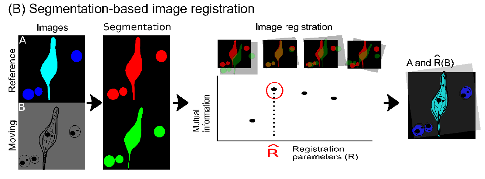
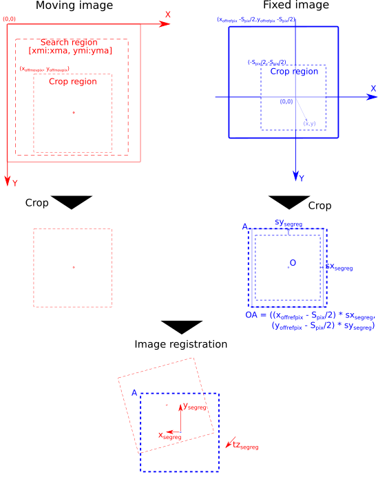

# multimodal image registration (SegReg)

The algorithm consists of two primary components: segmentation and registration. The segmentation step segments common objects in the images from both modalities, either automatically or with user assistance. The registration step maximizes a metric called mutual information (MI) while warping the moving image. The below provides the script for the registration step. The segmentation tools can be found elsewhere. 


## Installation
Unzip `segreg.zip`.
```
segreg/
│
├── assets/
  ├── navroi.png
  ├── segreg.png
├── utils/
  ├── csv_data.py
  ├── globalign.py
  ├── register.py
  ├── segment.py
  ├── transform2d.py
  ├── transform3d.py
  ├── util_cpu.py
  ├── util_gpu.py
├── A.tif
├── B.tif
├── create_figures.csv
├── environments.yaml
├── LICENSE
├── README.md
├── scan_Tx.py
├── scan_Ty.py
├── scan_xyzTz.ipynb
├── scan_xyzTz.py
├── scan_xyzTz_batch.py
├── sort_segreg.py
├── segreg_ubuntu20.def
```

### Guaranteed environments
- Ubuntu 20.04 with Graphical Processing Unit (NVIDIA A5000)
- [CREATE HPC](https://docs.er.kcl.ac.uk/)
- Windows 10 with Graphical Processing Unit (NVIDIA A6000)

### Building singularity container
Build a sif file from a def file in Ubuntu. Follow [Singularity](https://docs.sylabs.io/guides/3.7/user-guide/introduction.html) website.
```
$ sudo singularity build --notest segreg_ubuntu20.sif segreg_ubuntu20.def
```

Build a conda environment.
```
(base) $ conda env create -f environment.yaml
(base) $ conda activate segreg
(base) $ pip3 install torch torchvision --index-url https://download.pytorch.org/whl/cu124 # installing pytorch with gpu
```


## Usage
### Search for the best x, y, z, and Tz.
1. Prepare a pair of images and segmentation.
2. Define search region inside the moving image.
3. Run `scan_xyzTz.py` with appropriate arguments to create the best registration candidates. Arguments are defined with `--help` option.
    ```
    [Ubuntu]
    segreg $ singularity exec --nv segreg_ubuntu20.sif python3.8 scan_xyzTz.py --help
    segreg $ singularity exec --nv segreg_ubuntu20.sif python3.8 scan_xyzTz.py
    ```
    You can do the batch processing if you process a couple of image pairs.
    ```
    [Ubuntu]
    segreg $ singularity exec --nv segreg_ubuntu20.sif python3.8 scan_xyzTz_batch.py 
    ```
    ```
    [CREATE]
    (base) k-number@erc-hpc-login2:~/segreg$ cat scan_xyzTz_batch.sh
    #!/bin/bash -l
    #SBATCH --output=/scratch_tmp/users/%u/%j.out
    #SBATCH --job-name=gpu
    #SBATCH --gres=gpu
    singularity exec --nv \
    segreg_ubuntu20.sif \
    python3.8 scan_xyzTz_batch.py
    (base) k-number@erc-hpc-login2:~/segreg$ sbatch -p gpu scan_xyzTz_batch.sh
    (base) k-number@erc-hpc-comp192:~/segreg$ singularity exec --nv segreg_ubuntu20.sif python3.8 sort_segreg.py -r results_373_231009_SoRa_Blk_20x1x_seg_373_230614_A1_Blk_Reg2_40x_img
    ```

4. Sort results based on metric value and visually verify the result.
    ```
    [Ubuntu]
    $ singularity exec --nv segreg_ubuntu20.sif python3.8 sort_segreg.py --help
    $ singularity exec --nv segreg_ubuntu20.sif python3.8 sort_segreg.py --results-dir results_373_231009_SoRa_Blk_20x1x_seg_373_230614_A1_Blk_Reg2_40x_img
      Output results_373_231009_SoRa_Blk_20x1x_seg_373_230614_A1_Blk_Reg2_40x_img_mi_xyzTz.txt
      Output display_matches_results_373_231009_SoRa_Blk_20x1x_seg_373_230614_A1_Blk_Reg2_40x_im_mi_xyzTz.sh
    $ bash display_matches_results_373_231009_SoRa_Blk_20x1x_seg_373_230614_A1_Blk_Reg2_40x_im_mi_xyzTz.sh
    ```
    
    When you use the CREATE, visually verify the result in your local windows PC.
    ```
    [CREATE]
    (base) k-number@erc-hpc-login2:~$ srun -p interruptible_gpu --time 60 --p
    (base) k-number@erc-hpc-comp192:~/segreg$ singularity exec --nv segreg_ubuntu20.sif python3.8 sort_segreg.py -r results_373_231009_SoRa_Blk_20x1x_seg_373_230614_A1_Blk_Reg2_40x_img
      Output results_373_231009_SoRa_Blk_20x1x_seg_373_230614_A1_Blk_Reg2_40x_img_mi_xyzTz.txt
      Output display_matches_results_373_231009_SoRa_Blk_20x1x_seg_373_230614_A1_Blk_Reg2_40x_im_mi_xyzTz.bat
    ```
    Move the `bat` file into the `results_` folder and double-click the file.

5. Prepare a config file for visualization. See below for definition of keywords in the config file. This is used for [navROI](../napari-navroi/README.html) visualization.
- 'filepath': Path to the image (Tiff or Zarr format).
- 'name': Name of the image. The name is shown as napari layer.
- 'napari_ref': Whether the image is a reference image 'Y' or not 'N'.
- 'xyres_um': Pixel width and height of the image. Unit of micron.
- 'zres_um': Voxel depth of the image. Unit of micron.
- 'color': Colormap to use for luminance images.
- 'size': Size of the image.


- 'x_offmov': Output of `segreg`. See the above figure.
- 'y_offmov': Output of `segreg`. See the above figure.
- 'x_offref': X-coordinate of the upper left corner of the fixed image's coordinate system. See the above figure.
- 'y_offref': Y-coordinate of the upper left corner of the fixed image's coordinate system. See the above figure.
- 'tx_segreg': Output of `segreg`. See the above figure.
- 'ty_segreg': Output of `segreg`. See the above figure.
- 'tz_segreg': Output of `segreg`. See the above figure.
- 'x_segreg': Output of `segreg`. See the above figure.
- 'y_segreg': Output of `segreg`. See the above figure.
- 'z_segreg': Output of `segreg`. See the above figure.
- 'sx_segreg': Output of `segreg`. See the above figure.
- 'sy_segreg': Output of `segreg`. See the above figure.
- 'dx': Amount of translation in the X direction in the napari viewer. Arbitrary value.
- 'dy': Amount of translation in the X direction in the napari viewer. Arbitrary value.
- 'affinder_output': Path to the output file of the [affinder](https://www.napari-hub.org/plugins/affinder) plugin.

### Search for the best Ty
```
$ singularity exec --nv segreg_ubuntu20.sif python3.8 scan_Ty.py --help
$ singularity exec --nv segreg_ubuntu20.sif python3.8 scan_Ty.py 
$ singularity exec --nv segreg_ubuntu20.sif python3.8 sort_registrations.py 
```

### Search for the best Tx
```
$ singularity exec --nv segreg_ubuntu20.sif python3.8 scan_Tx.py --help
$ singularity exec --nv segreg_ubuntu20.sif python3.8 scan_Tx.py 
$ singularity exec --nv segreg_ubuntu20.sif python3.8 sort_registrations.py 
```

### Data
Data can be downloaded from [BioImage Archive](https://www.ebi.ac.uk/biostudies/bioimages/studies/S-BIAD2077) and [EMPIRE](https://www.ebi.ac.uk/empiar/EMPIAR-xxx/).


## License
Distributed under the terms of the [MIT](https://opensource.org/license/MIT) license,
"SegReg" is free and open source software.

## Contributing
Contributions are very welcome. 
If you encounter any problems, please send an email to: juan.burrone@kcl.ac.uk along with a detailed description. 

## Citing
```
@article{konishi2024navroi,
  title={Semi-automated navigation for efficient targeting of electron tomography to regions of interest in volume correlative light and electron microscopy},
  author={Kohki Konishi, Guilherme Neves, Matthew Russell, Masafumi Mimura, Juan Burrone, Roland Fleck},
  journal={bioRxiv: 2024.11.29.626074},
  year={2024}
}
```